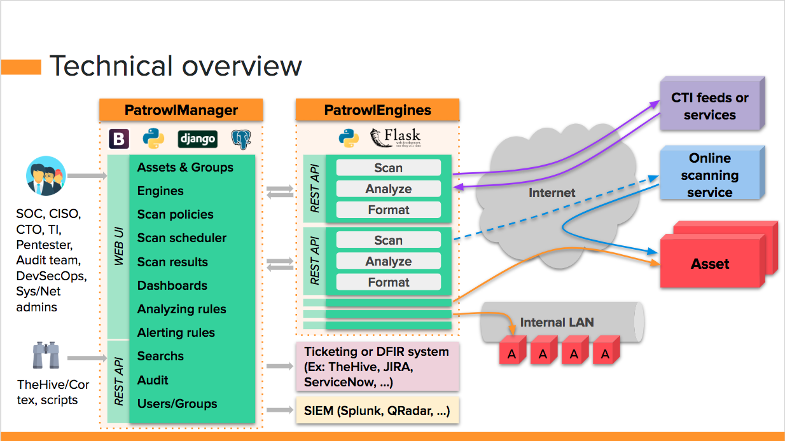
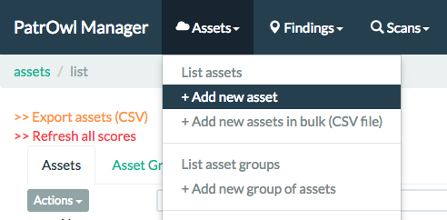
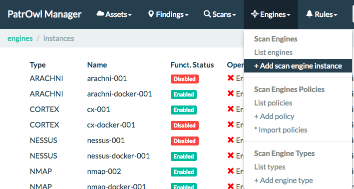
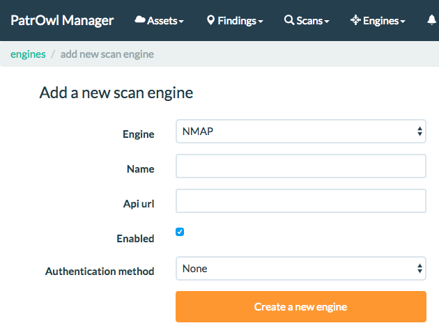

# User Guide
After installing and deploying PatrowlManager and at least one PatrowlEngine, you can now feel the power of PatrOwl! Let's go quickly into the heart of the matter with this quick user guide. Detailed documentation will be released soon.

## Table of Contents
+ [Technical overview](#technical_overview)
+ [Assets](#assets)
  - [Add a new asset](#add_a_new_asset)
+ [Engines](#engines)
  - [Add a new engine](#add_a_new_engine)
+ [Scans](#scans)
  - [Add a new scan](#add_a_new_scan)

## Technical overview
PatrOwl is composed of a Front-end application **PatrowlManager** communicating with one or multiple **PatrowlEngines** micro-applications which perform the scans, analyze the results and format them in a normalized way.

The PatrowlManager application is reacheable using the embedded WEB interface or using the JSON-API. PatrowlEngines are only available throught generic JSON-API calls.

## Assets
### Add a new Asset
1. Go to the creation form using the header menu bar or go directly to the URL `/assets/add`.

2. The following form will be available:

Some tips:

Parameters | Description | Examples
---------- | ----------- | -----------
`Value` | Value of the asset  | *8.8.8.8*, *patrowl.io*, *myorg.local*, *https://app.patrowl.io*
`Name` | Quick title of the asset | MyCORP DNS A, Corporate Website
`Type` | Type of the asset. Available scan policies will be filtered on this value | *IP*, *FQDN*, *DOMAIN*, *URL*, *KEYWORD*, *PATH* or *PERSON*
`Description` | Free text area for describing the asset | *Corporate website based on Drupal 7.3 and exposed on Internet*
`Criticity` | Business criticity of the asset. Global risk scoring will depend on this value | *Low*, *Medium* or *High*
`Categories` | List of tags to quickly describe the asset. Custom values could be added. | *Windows*, *Database*, *Corporate Website*

3. Click to the button "Create a new asset" to confirm the creation. You will be redirected to the assets list.

## Engines
### Add a new Engine
1. Go to the creation form using the header menu bar or go directly to the URL `/engines/add`.

2. The following form will be available:

Parameters | Description | Examples
---------- | ----------- | -----------
`Engine` | Type of the engine | *NMAP*, *VIRUSTOTAL*, *ARACHNI*, *CORTEX*, *OWL_LEAKS*
`Name` | Name of the engine | *nmap-001*, *vt-001*, *arachni-docker-001*, *cortex-001*, *oleaks-001*
`Api url` | URL address of the engine | *http://localhost:5001/engines/nmap/*, *http://external-server:5012/engines/owl_leaks/*
`Enable` | Choose if you want to enable the engine once created | *n/a.*
`Authentication method` | Select the authentication method to access to the engine from the PatrowlManager host (Only 'None' is available for the moment) | *None*, *HTTPBasic*, *APIKey*

3. Click to the button "Create a new engine" to confirm the creation. You will be redirected to the engines list.

## Scans
### Add a new Scan
1. Go to the creation form using the header menu bar or go directly to the URL `/scans/defs/add`.

2. The following form will be available:

Parameters | Description | Examples
---------- | ----------- | -----------
`Title` | Title of the scan | *"List open ports on Internet-faced assets"*, *"Scan XSS on corporate website"*, *"Search technical leaks on GitHub and Twitter"*
`Description` | Description of the scan | *"Here a long description of the scan purposes"*
`Scan type` | Scans could be started once or periodically | *"On-Demand"* or *Periodical*
`Start scan` | Select the moment to start the scan(s): Later (not now, just create the scan definition), Now or Scheduled at a precise datetime | *"Later"*, *Periodical*, *Scheduled at*
`Search asset(s)` | Search and select asset(s) targeted by the scan. Search criteria are asset `value`, `name`, `description` and `categories` | *"8.8.8 +`Enter` "*, *DNS +`Enter`*
`Filter by Engine` and `Or, Filter by Category` | Search the scan policy using the Engine or the Category filter | *n/a*
`Select Policy` | Select the scan policy | *n/a*
`Select Engine` | Select the scan engine which will perform the scan each times. It could be *Random* and the first available engine will perform the scan | *n/a*

3. Click to the button "Create a new scan" to confirm the creation. You will be redirected to the scans list.
